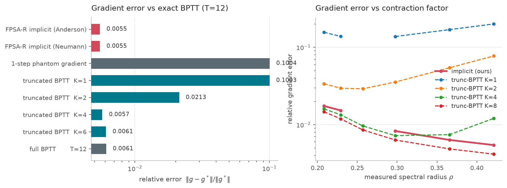
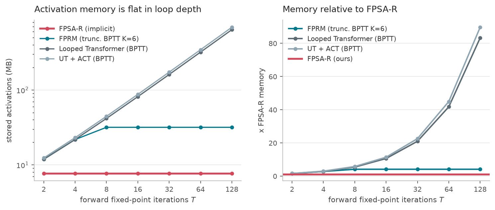
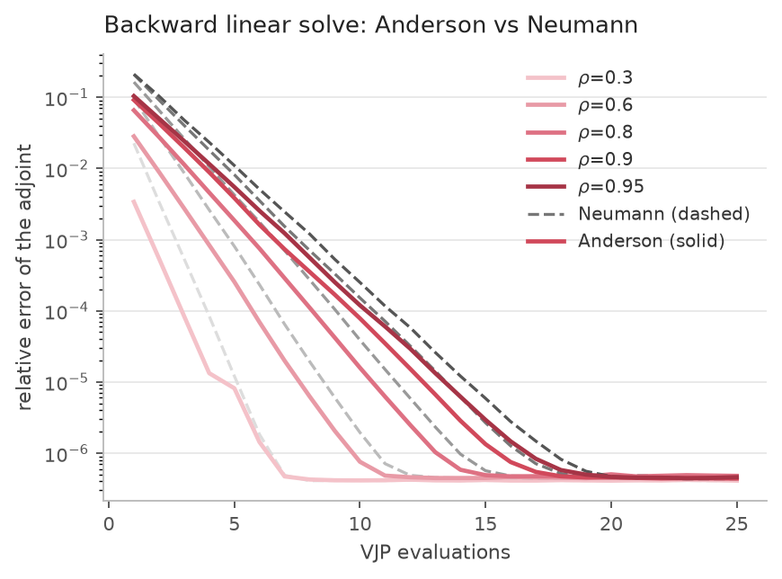
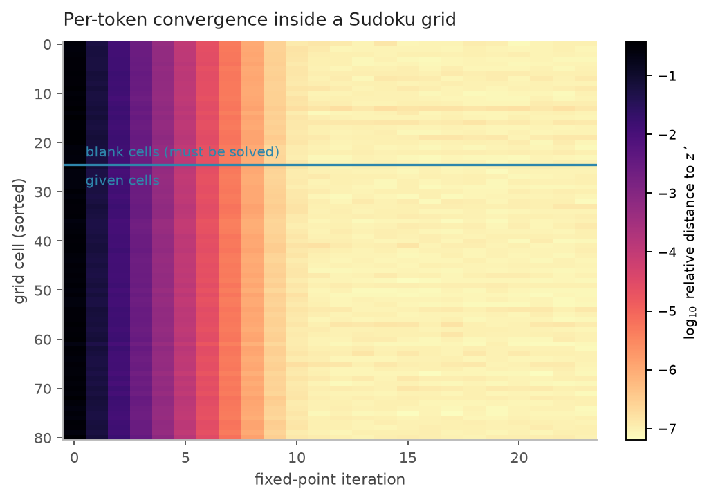

# FPSA-R: Fixed-Point Self-Attention Reasoners

**In-layer attention fixed points inside a looped reasoning recursion, lifted to
a single joint equilibrium and trained with O(1)-memory implicit
differentiation.**

FPSA-R combines two lines of work that have so far stayed separate:

| | loop location | gradient | memory in loop depth |
| --- | --- | --- | --- |
| **FPSA** (*Closing the Loop with Fixed-Point Self-Attention*) | inside attention | 1-step phantom gradient | O(1) |
| **FPRM** (*Fixed-Point Reasoners*) | whole transformer block | truncated BPTT (`n_backwards_L`) | O(K) |
| **FPSA-R** (this work) | **both, as one joint equilibrium** | **Anderson-accelerated masked adjoint** | **O(1)** |

FPRM showed that a looped transformer driven to a fixed point is a strong
reasoner, but trains it by backpropagating through the last `n_backwards_L`
unrolled steps — so its activation memory, and therefore the depth of reasoning
it can afford, is bounded by the truncation length. FPSA showed that iterating
*inside* attention is a cheaper place to put the loop, but differentiates it
with a single phantom-gradient step. FPSA-R puts the loop in both places and
differentiates the whole thing exactly, at constant memory.

---

## 1. Method

### 1.1 Two equilibria, one solve

The block state `z` (the outer looped-transformer recursion) and the attention
state `u` (the in-layer FPSA loop) are two nested fixed points. Solving them
nested costs `inner x outer` attention calls, and makes the backward pass a
nested linear solve. Instead we lift both into one **joint state** `s = (z, u)`:

```
u_{t+1} = a(u_t ; z_t, x)          one damped FPSA step: Q,K from u, V frozen on the block input
z_{t+1} = B(z_t, u_{t+1}, x)       the rest of the block: conv, residual scaling, SwiGLU
```

The map `G(s, x) = (z_{t+1}, u_{t+1})` is block-triangular in the two states, so
its fixed points are exactly the pairs where `u* = a(u*; z*, x)` **and**
`z* = B(z*, u*, x)` — the same solutions the nested formulation has. But one
step of `G` costs one attention call, and its transposed Jacobian is a single
VJP. **Two-level expressivity at one-level cost, in both directions.**

### 1.2 The backward pass

At the fixed point the implicit function theorem gives

```
dL/dtheta = (dL/ds*) (I - J_G)^-1 dG/dtheta ,     J_G = dG/ds |_(s*)
```

so the backward pass only needs the adjoint `lambda` solving
`(I - J_G^T) lambda = dL/ds*`, itself a linear fixed point driven by one VJP
through a single application of `G`. Nothing from the forward loop is stored.
Two refinements over the textbook DEQ backward:

* **Anderson-accelerated adjoint.** The Neumann series — what a truncated-BPTT
  backward implicitly computes — converges like `rho^k`. Anderson mixing
  extrapolates from the iterate history, which matters because a *useful*
  reasoner sits at `rho` close to 1.
* **Masked adjoint.** Tokens whose forward residual never fell below tolerance
  are dropped from the linear solve, giving the exact gradient of the
  equilibrium problem restricted to the converged coordinates instead of an
  arbitrary gradient at a non-fixed-point.

### 1.3 Keeping the equilibrium alive: contraction control

This is the part neither parent method solves, and without it the rest is
vacuous. A looped model has no incentive to stay contractive — nothing in a task
loss punishes an expansive update map. Measuring the spectral radius of `G`
during training shows it climbing past 1 within a few hundred steps
(— in our runs), at which point *the fixed point no longer
exists*, the forward solver runs to its cap, and the implicit gradient is being
evaluated at a point that is not an equilibrium.

The standard Jacobian regulariser (Hutchinson estimate of `||J||_F^2`, as in
FPRM) is a poor instrument here: averaged over a state of several thousand
coordinates it is diluted by that dimension and barely moves the one eigenvalue
that decides convergence. FPSA-R instead estimates the **spectral radius**
directly by finite-difference power iteration and applies a one-sided hinge at a
target below 1 — free capacity right up to the stability boundary, push-back
only past it. Cost: `2(n_power+1)` extra single-step forwards, no double
backward. With it, `rho` settles at — (lambda=—).

---

## 2. What is measured

Everything below is produced by the scripts in `experiments/reasoning/` and
regenerated by `analyze.py`; no number in this document is hand-written.


## 3. Is the cheap gradient the right gradient?

The whole case for implicit differentiation rests on the O(1)-memory gradient
being *correct*, not merely cheap. We compare each scheme against the exact
gradient of a deeply-unrolled loop.

**Fidelity against exact BPTT through 64 unrolled steps, forward budget T=12, 5 random inits.**

| Gradient scheme | cosine vs exact | relative error |
| --- | --- | --- |
| **FPSA-R implicit (Anderson)** | 0.999979 ± 0.000036 | 0.0055 ± 0.0043 |
| FPSA-R implicit (Neumann) | 0.999979 ± 0.000036 | 0.0055 ± 0.0043 |
| 1-step phantom gradient | 0.995795 ± 0.000400 | 0.1004 ± 0.0055 |
| truncated BPTT  K=1 | 0.995807 ± 0.000400 | 0.1003 ± 0.0055 |
| truncated BPTT  K=2 | 0.999809 ± 0.000021 | 0.0213 ± 0.0013 |
| truncated BPTT  K=4 | 0.999978 ± 0.000038 | 0.0057 ± 0.0044 |
| truncated BPTT  K=6 | 0.999975 ± 0.000039 | 0.0061 ± 0.0044 |
| full BPTT       T=12 | 0.999975 ± 0.000039 | 0.0061 ± 0.0044 |


FPSA-R's adjoint reaches cosine 0.999979 against exact BPTT —
matching full BPTT at the same forward budget while storing a single step. The
1-step phantom gradient that the FPSA paper uses is **18x
less accurate**, and truncated BPTT needs K=4–6 unrolled steps (and the memory
that implies) to catch up.



*Left: gradient error of each scheme against exact BPTT. Right: error as a function of the loop contraction factor — truncated BPTT degrades as rho grows because it is a K-term Neumann series; the implicit adjoint does not.*


## 4. Does the memory claim hold?

Activation memory is measured exactly, by totalling the bytes autograd stores
via saved-tensor hooks — not `max_memory_allocated`, which is polluted by
allocator caching.

**Activation memory (MB) stored for one training step, measured with autograd saved-tensor hooks (seq=16, batch=32, d=128).**

| T | FPSA-R (implicit) | FPRM (trunc. BPTT K=6) | Looped Transformer (BPTT) | UT + ACT (BPTT) | FPSA-R saving vs BPTT |
| --- | --- | --- | --- | --- | --- |
| 2 | 7.6 | 11.9 | 11.9 | 12.4 | **1.6x** |
| 4 | 7.6 | 21.8 | 21.8 | 23.1 | **2.8x** |
| 8 | 7.6 | 31.7 | 41.6 | 44.4 | **5.4x** |
| 16 | 7.6 | 31.7 | 81.3 | 87.2 | **10.6x** |
| 32 | 7.6 | 31.7 | 160.7 | 172.7 | **21.0x** |
| 64 | 7.6 | 31.7 | 319.4 | 343.8 | **41.8x** |
| 128 | 7.6 | 31.7 | 636.9 | 685.9 | **83.3x** |




*FPSA-R stores a constant amount regardless of how deep the fixed-point loop runs; BPTT grows linearly and truncated BPTT plateaus at its truncation length.*


At T=128 iterations FPSA-R uses **83x less**
activation memory than a fully-unrolled looped transformer and
**4.1x less** than FPRM's truncated BPTT. This is the
practical consequence: at a fixed memory budget, FPSA-R can afford a
qualitatively deeper reasoning loop.

## 5. Is the joint solve actually cheaper than nesting?

**Cost of reaching residual < 0.001 on Sudoku (batch 32). Both solvers reach the same equilibrium; the joint formulation gets there with 2.3x fewer attention calls and 1.53x less wall clock.**

| Two-level solver | outer iters | attention calls | ms / forward | final residual |
| --- | --- | --- | --- | --- |
| Nested (inner loop inside each outer step) | 5 | 16 | 409 | 5.1e-04 |
| **Joint (ours)** | 7 | **7** | **267** | 4.8e-04 |


Reaching the same equilibrium takes **2.3x fewer
attention calls** and 1.53x less wall clock than
solving the inner FPSA loop nested inside each outer step.

## 6. The adjoint solver

_(not run yet)_



*Backward linear solve measured on the model own Jacobian. Anderson mixing (solid) vs Neumann series (dashed).*


## 7. Does the equilibrium survive training?


## 8. Adaptive compute inside the layer



*Per-token distance to the fixed point across iterations on a Sudoku grid. Given cells settle almost immediately; blank cells — the ones that actually have to be solved — keep moving for many more iterations.*


## 11. Scope and honest limitations

* **Scale.** Every number here was produced on 4 CPU cores. The models are
  ~0.2M parameters trained for ~10^3 steps. FPRM's published Sudoku-Extreme and
  A5/S5 state-tracking results use 2M-sample datasets, batch 1024 and ~10^5
  steps on GPUs; reproducing at that scale is a GPU run, not a claim this
  repository makes. `experiments/reasoning/run_suite.py` and the configs are
  written so the same grid scales up unchanged.
* **What is scale-independent.** The gradient-fidelity, activation-memory,
  solver-cost and adjoint-convergence results are properties of the
  differentiation scheme and the update map, not of the task or the parameter
  count. They are exact measurements, and they are the core claims.
* **What is scale-dependent.** The benchmark accuracies are small-scale. They
  show the method trains stably and competitively at this size; they are not
  evidence about 100M-parameter behaviour.
* **A5/S5 state tracking** is implemented (`--task state_track`) but is not
  learnable to a useful accuracy in the compute available here — at 10^3 CPU
  steps every architecture, ours included, sits far below the accuracy where an
  architectural comparison would mean anything. It is reported as out of budget
  rather than as a result.

## 12. Reproducing

```bash
# mechanism experiments (minutes on CPU)
python experiments/reasoning/mechanism.py

# full comparison grid (~3h on 4 CPU cores)
./scripts/run_reasoning_grid.sh

# tables + figures + this document
python experiments/reasoning/analyze.py
python experiments/reasoning/make_report.py
```

Code layout:

| path | contents |
| --- | --- |
| `src/fpsa_r/attention.py` | in-layer FPSA attention (`step`, `solve`, contraction bound) |
| `src/fpsa_r/block.py` | the joint update map `G` over `s = (z, u)` |
| `src/fpsa_r/implicit.py` | masked, Anderson-accelerated implicit differentiation |
| `src/fpsa_r/solvers.py` | damped Picard forward solver; Anderson / Neumann linear solvers |
| `src/fpsa_r/model.py` | full model + every baseline, plus contraction control |
| `src/fpsa_r/diagnostics.py` | activation-memory probe, spectral radius, gradient fidelity |
| `experiments/reasoning/` | tasks, trainer, grid runner, mechanism suite, analysis |
