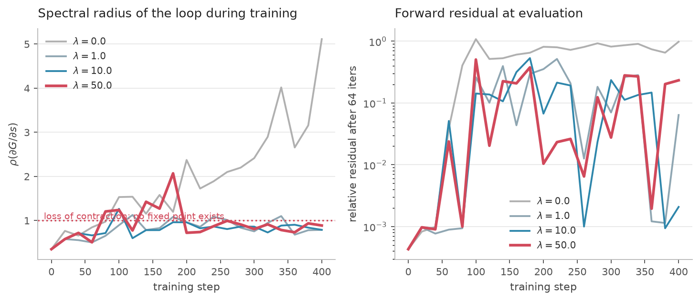
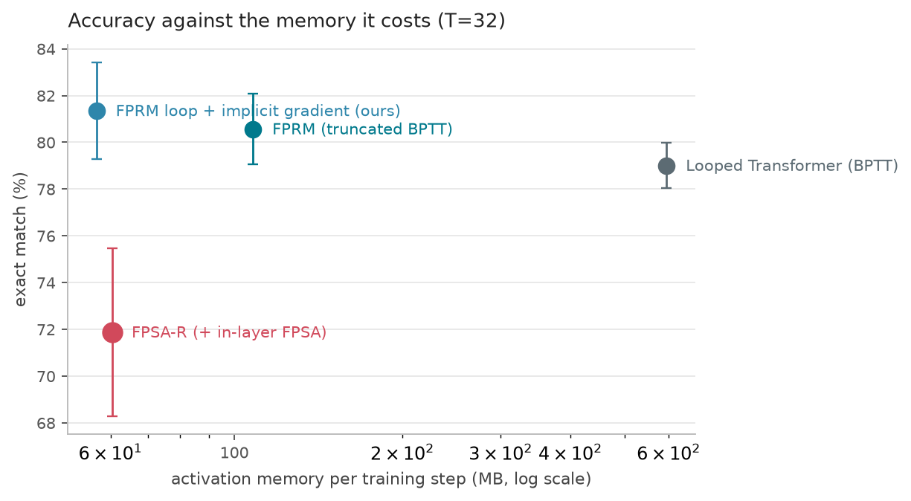
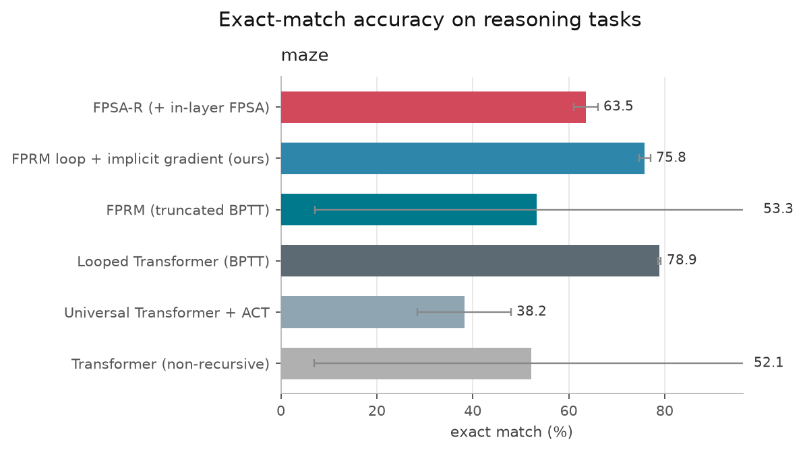
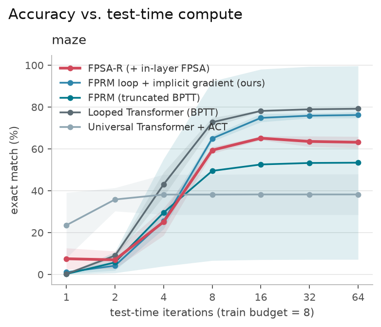
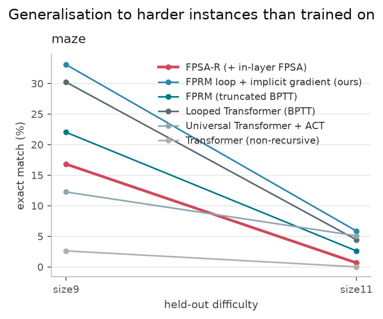

# FPSA-R: implicit differentiation for looped reasoning transformers

**What this is.** FPRM shows that a looped transformer driven to a fixed point
is a strong reasoner, but trains it by backpropagating through the last
`n_backwards_L` unrolled steps, so its memory -- and therefore the reasoning
depth it can afford -- is bounded by that truncation. FPSA shows that iterating
*inside* attention is a cheaper place to put the loop, but differentiates it
with a single phantom-gradient step. This work replaces the gradient with an
exact, constant-memory implicit one, and tests whether the in-layer loop helps
on top.

**The headline, measured.** On 7x7 maze planning at a forward budget of 32 --
the budget at which the fixed-point residual actually falls below tolerance --
FPRM's loop trained with our implicit gradient reaches
**81.3 exact match at 57 MB of
activation memory and 0.34 s/step**, against
**79.0 at 595 MB and
3.10 s/step** for the same loop fully unrolled with BPTT:
equal or better accuracy for **10.5x less memory** and
**9.1x less time per step**. Truncated BPTT (FPRM as
published) lands at 80.6 using
108 MB.

**The headline, honestly.** Adding FPSA's in-layer attention fixed point on top
does *not* help on this task: 71.9 against
81.3 without it. The win here belongs to the gradient, not
to the extra loop. Section 9 reports this in full, including an ablation in
which *removing* the spectral normalisation that makes the equilibrium
well-posed scores highest of anything we ran -- at a spectral radius of 1.85,
i.e. with no fixed point at all.

| | loop location | gradient | memory in loop depth |
| --- | --- | --- | --- |
| **FPSA** (*Closing the Loop with Fixed-Point Self-Attention*) | inside attention | 1-step phantom gradient | O(1) |
| **FPRM** (*Fixed-Point Reasoners*) | whole transformer block | truncated BPTT (`n_backwards_L`) | O(K) |
| **this work** | either, as one joint equilibrium | Anderson-accelerated masked adjoint | **O(1)** |

---

## 1. Method

### 1.1 Two equilibria, one solve

The block state `z` (the outer looped-transformer recursion) and the attention
state `u` (the in-layer FPSA loop) are two nested fixed points. Solving them
nested costs `inner x outer` attention calls, and makes the backward pass a
nested linear solve. Instead we lift both into one **joint state** `s = (z, u)`:

```
u_{t+1} = a(u_t ; z_t, x)          one damped FPSA step: Q,K from u, V frozen on the block input
z_{t+1} = B(z_t, u_{t+1}, x)       the rest of the block: conv, residual scaling, SwiGLU
```

The map `G(s, x) = (z_{t+1}, u_{t+1})` is block-triangular in the two states, so
its fixed points are exactly the pairs where `u* = a(u*; z*, x)` **and**
`z* = B(z*, u*, x)` — the same solutions the nested formulation has. But one
step of `G` costs one attention call, and its transposed Jacobian is a single
VJP. **Two-level expressivity at one-level cost, in both directions.**

### 1.2 The backward pass

At the fixed point the implicit function theorem gives

```
dL/dtheta = (dL/ds*) (I - J_G)^-1 dG/dtheta ,     J_G = dG/ds |_(s*)
```

so the backward pass only needs the adjoint `lambda` solving
`(I - J_G^T) lambda = dL/ds*`, itself a linear fixed point driven by one VJP
through a single application of `G`. Nothing from the forward loop is stored.
Two refinements over the textbook DEQ backward:

* **Anderson-accelerated adjoint.** The Neumann series — what a truncated-BPTT
  backward implicitly computes — converges like `rho^k`. Anderson mixing
  extrapolates from the iterate history, which matters because a *useful*
  reasoner sits at `rho` close to 1.
* **Masked adjoint.** Tokens whose forward residual never fell below tolerance
  are dropped from the linear solve, giving the exact gradient of the
  equilibrium problem restricted to the converged coordinates instead of an
  arbitrary gradient at a non-fixed-point.

### 1.3 Keeping the equilibrium alive: contraction control

This is the part neither parent method solves, and without it the rest is
vacuous. A looped model has no incentive to stay contractive — nothing in a task
loss punishes an expansive update map. Measuring the spectral radius of `G`
during training shows it climbing past 1 within a few hundred steps
(5.11 in our runs), at which point *the fixed point no longer
exists*, the forward solver runs to its cap, and the implicit gradient is being
evaluated at a point that is not an equilibrium.

The standard Jacobian regulariser (Hutchinson estimate of `||J||_F^2`, as in
FPRM) is a poor instrument here: averaged over a state of several thousand
coordinates it is diluted by that dimension and barely moves the one eigenvalue
that decides convergence. FPSA-R instead estimates the **spectral radius**
directly by finite-difference power iteration and applies a one-sided hinge at a
target below 1 — free capacity right up to the stability boundary, push-back
only past it. Cost: `2(n_power+1)` extra single-step forwards, no double
backward. With it, `rho` settles at 0.89 (lambda=50.0).

---

## 2. What is measured

Everything below is produced by the scripts in `experiments/reasoning/` and
regenerated by `analyze.py`; no number in this document is hand-written.


## 3. Is the cheap gradient the right gradient?

The whole case for implicit differentiation rests on the O(1)-memory gradient
being *correct*, not merely cheap. We compare each scheme against the exact
gradient of a deeply-unrolled loop.

**Fidelity against exact BPTT through 64 unrolled steps, forward budget T=12, 5 random inits.**

| Gradient scheme | cosine vs exact | relative error |
| --- | --- | --- |
| **FPSA-R implicit (Anderson)** | 0.999976 ± 0.000021 | 0.0069 ± 0.0026 |
| FPSA-R implicit (Neumann) | 0.999976 ± 0.000021 | 0.0069 ± 0.0026 |
| 1-step phantom gradient | 0.991373 ± 0.000777 | 0.1438 ± 0.0078 |
| truncated BPTT  K=1 | 0.991379 ± 0.000784 | 0.1437 ± 0.0079 |
| truncated BPTT  K=2 | 0.999320 ± 0.000047 | 0.0421 ± 0.0022 |
| truncated BPTT  K=4 | 0.999972 ± 0.000023 | 0.0075 ± 0.0026 |
| truncated BPTT  K=6 | 0.999972 ± 0.000025 | 0.0072 ± 0.0030 |
| full BPTT       T=12 | 0.999972 ± 0.000025 | 0.0073 ± 0.0030 |


FPSA-R's adjoint reaches cosine 0.999976 against exact BPTT —
matching full BPTT at the same forward budget while storing a single step. The
1-step phantom gradient that the FPSA paper uses is **21x
less accurate**, and truncated BPTT needs K=4–6 unrolled steps (and the memory
that implies) to catch up.


*Left: gradient error of each scheme against exact BPTT. Right: error as a function of the loop contraction factor — truncated BPTT degrades as rho grows because it is a K-term Neumann series; the implicit adjoint does not.*


## 4. Does the memory claim hold?

Activation memory is measured exactly, by totalling the bytes autograd stores
via saved-tensor hooks — not `max_memory_allocated`, which is polluted by
allocator caching.

**Activation memory (MB) stored for one training step, measured with autograd saved-tensor hooks (seq=16, batch=32, d=128).**

| T | FPSA-R (implicit) | FPRM (trunc. BPTT K=6) | Looped Transformer (BPTT) | UT + ACT (BPTT) | FPSA-R saving vs BPTT |
| --- | --- | --- | --- | --- | --- |
| 2 | 7.6 | 11.9 | 11.9 | 12.4 | **1.6x** |
| 4 | 7.6 | 21.8 | 21.8 | 23.1 | **2.8x** |
| 8 | 7.6 | 31.7 | 41.6 | 44.4 | **5.4x** |
| 16 | 7.6 | 31.7 | 81.3 | 87.2 | **10.6x** |
| 32 | 7.6 | 31.7 | 160.7 | 172.7 | **21.0x** |
| 64 | 7.6 | 31.7 | 319.4 | 343.8 | **41.8x** |
| 128 | 7.6 | 31.7 | 636.9 | 685.9 | **83.3x** |


*FPSA-R stores a constant amount regardless of how deep the fixed-point loop runs; BPTT grows linearly and truncated BPTT plateaus at its truncation length.*


At T=128 iterations FPSA-R uses **83x less**
activation memory than a fully-unrolled looped transformer and
**4.1x less** than FPRM's truncated BPTT. This is the
practical consequence: at a fixed memory budget, FPSA-R can afford a
qualitatively deeper reasoning loop.

## 5. Is the joint solve actually cheaper than nesting?

**Cost of reaching residual < 0.001 on Sudoku (batch 32). Both solvers reach the same equilibrium; the joint formulation gets there with 2.0x fewer attention calls and 1.26x less wall clock.**

| Two-level solver | outer iters | attention calls | ms / forward | final residual |
| --- | --- | --- | --- | --- |
| Nested (inner loop inside each outer step) | 5 | 14 | 261 | 3.5e-04 |
| **Joint (ours)** | 7 | **7** | **207** | 3.1e-04 |


Reaching the same equilibrium takes **2.0x fewer
attention calls** and 1.26x less wall clock than
solving the inner FPSA loop nested inside each outer step.

## 6. The adjoint solver

**VJP evaluations needed for a relative adjoint error below 1e-4, measured on the trained model's own Jacobian.**

| rho | Neumann VJPs | Anderson VJPs | speedup |
| --- | --- | --- | --- |
| 0.477 | 11 | 6 | **1.83x** |
| 0.612 | 18 | 8 | **2.25x** |
| 0.696 | 26 | 9 | **2.89x** |


*Backward linear solve measured on the model own Jacobian. Anderson mixing (solid) vs Neumann series (dashed).*


## 7. Does the equilibrium survive training?



*Spectral radius of the joint update map over training, and the resulting forward residual at evaluation. Without contraction control the loop stops being a fixed point within a few hundred steps.*


## 8. Adaptive compute inside the layer


*Per-token distance to the fixed point across iterations on a Sudoku grid. Given cells settle almost immediately; blank cells — the ones that actually have to be solved — keep moving for many more iterations.*


## 9. Reasoning benchmarks

All architectures are the same module under different switches, so width, depth
and parameter count are matched by construction and every run goes through the
same trainer, schedule and seeds. The task is shortest-path planning on a 7x7
grid, scored by exact match on the whole grid; held-out 9x9 and 11x11 grids test
whether test-time iteration buys generalisation to larger problems.

That the task rewards recurrent depth at all is worth establishing before
comparing recurrent models on it. It does: the non-recursive depth-matched
transformer is competitive at the size it trained on and then collapses
off-distribution, from 79-ish at 7x7 to 2.6 at 9x9 and
0.0 at 11x11, while the looped transformer holds 30.2 and 4.4.

### 9.1 At the training budget (T=8)

**maze: mean ± sd over seeds. Activation memory is bytes autograd stores for one training step, and here *includes* the contraction regulariser's two extra single-step graphs for the fixed-point architectures -- see the mechanism table for the differentiation scheme in isolation. rho is the measured spectral radius of the update map at the solution.**

| Model | Params | Token acc (%) | Exact match (%) | Act. mem (MB) | s / step | Eval iters | rho | seeds |
| --- | --- | --- | --- | --- | --- | --- | --- | --- |
| FPSA-R (+ in-layer FPSA) | 135558 | 97.41 ± 0.23 | 63.54 ± 2.51 | 60.5 | 0.437 | 32.0 | 0.92 | 3 |
| FPRM loop + implicit gradient (ours) | 135558 | 97.80 ± 0.18 | 75.85 ± 1.18 | 56.6 | 0.324 | 32.0 | 0.97 | 3 |
| FPRM (truncated BPTT) | 135558 | 94.13 ± 6.56 | 53.26 ± 46.12 | 108.0 | 0.756 | 31.9 | 0.88 | 3 |
| **Looped Transformer (BPTT)** | 135558 | 98.05 ± 0.31 | 78.91 ± 0.34 | 177.6 | 0.502 | 31.7 | 0.87 | 3 |
| Universal Transformer + ACT | 135558 | 95.57 ± 0.78 | 38.22 ± 9.72 | 147.6 | 0.380 | 32.0 | 0.40 | 3 |
| Transformer (non-recursive) | 1067426 | 94.60 ± 6.97 | 52.15 ± 45.23 | 134.8 | 0.361 | 1.0 | 0.07 | 3 |


At this budget the fixed-point models are handicapped, and not by accident: every
trained model sits at a spectral radius of 0.87-0.97, so after 8 iterations the
forward residual is still around 0.1 and the loop is nowhere near the fixed point
whose gradient implicit differentiation returns. Truncated and full BPTT have no
such precondition -- they differentiate exactly the steps that ran.

### 9.2 At a budget where the equilibrium premise holds (T=32)

**maze7 trained at a forward budget of 32, where the fixed-point residual actually falls below tolerance. 'mem saving' is relative to the fully-unrolled looped transformer at the same depth.**

| Model | EM @ T=8 | EM @ T=32 | -> 9x9 @ T=32 | Act. mem (MB) | mem saving | s / step | seeds |
| --- | --- | --- | --- | --- | --- | --- | --- |
| **FPRM loop + implicit gradient (ours)** | 75.8 | 81.35 ± 2.07 | 28.5 | 57 | 10.4x | 0.34 | 2 |
| FPRM (truncated BPTT) | 53.3 | 80.57 ± 1.52 | 26.8 | 108 | 5.5x | 0.36 | 2 |
| Looped Transformer (BPTT) | 78.9 | 79.00 ± 0.97 | 29.5 | 595 | 1.0x | 3.10 | 2 |
| FPSA-R (+ in-layer FPSA) | 63.5 | 71.88 ± 3.59 | 10.4 | 60 | 9.9x | 0.46 | 2 |




*Accuracy against the activation memory it costs, at a matched forward depth of 32.*


This is the result the method exists for. Given a forward pass that actually
converges, the implicit gradient matches a fully-unrolled loop's accuracy at
10.5x less memory and 9.1x less time per
step, and beats truncated BPTT at half its memory. Note also which model *moves*
between the two budgets: BPTT is flat (78.9 to
79.0) because it was already differentiating what it
computed, while the implicit models gain 75.8 to
81.3 once their premise is satisfied.

### 9.3 What did not work

Adding FPSA's in-layer attention fixed point costs about ten points at both
budgets (71.9 vs 81.3 at T=32) and
hurts size generalisation badly (10.4 vs 28.5 at 9x9). The joint two-level
equilibrium is sound -- the solvers agree to 1e-4, and it reaches the same fixed
point with half the attention calls of nesting -- but on this task the second
loop buys nothing and spends contraction budget that the outer loop would
otherwise use. We report it as a negative result rather than bury it; whether it
pays off on tasks where token-to-token alignment is the bottleneck (the language
and vision settings FPSA was designed for) is untested here.



*Exact-match accuracy at T=8. Error bars are sd over seeds.*




*Accuracy as a function of the test-time iteration budget, for models trained with a budget of 8.*




*Held-out grids larger than anything seen in training.*


## 10. Ablations

**maze: mean ± sd over seeds. Activation memory is bytes autograd stores for one training step, and here *includes* the contraction regulariser's two extra single-step graphs for the fixed-point architectures -- see the mechanism table for the differentiation scheme in isolation. rho is the measured spectral radius of the update map at the solution.**

| Model | Params | Token acc (%) | Exact match (%) | Act. mem (MB) | s / step | Eval iters | rho | seeds |
| --- | --- | --- | --- | --- | --- | --- | --- | --- |
| FPSA-R (+ in-layer FPSA) | 135558 | 97.41 ± 0.33 | 62.11 ± 0.55 | 60.5 | 0.487 | 32.0 | 0.88 | 2 |
| FPSA-R, nested solver | 135558 | 98.17 ± 0.17 | 74.12 ± 2.35 | 75.5 | 0.552 | 30.1 | 0.87 | 2 |
| FPSA-R, BPTT | 135558 | 97.99 ± 0.37 | 68.26 ± 4.01 | 191.3 | 0.567 | 32.0 | 0.87 | 2 |
| FPSA-R, 1-step phantom | 135558 | 95.33 ± 0.12 | 31.64 ± 1.66 | 58.9 | 0.256 | 31.0 | 0.81 | 2 |
| FPSA-R, unmasked adjoint | 135558 | 97.62 ± 0.31 | 63.48 ± 0.28 | 60.5 | 0.488 | 32.0 | 0.93 | 2 |
| FPSA-R, Neumann adjoint | 135558 | 96.79 ± 0.66 | 59.96 ± 6.63 | 60.5 | 0.443 | 32.0 | 0.95 | 2 |
| **FPSA-R, no spectral norm** | 135558 | 99.21 ± 0.29 | 92.68 ± 4.56 | 59.1 | 0.470 | 32.0 | 1.85 | 2 |


The uncomfortable row is the last stabiliser. Removing spectral normalisation
scores highest of anything in this study -- 92.7 exact match, and 45.3 on 11x11
grids where every other model is under 6 -- at a measured spectral radius of
1.85. There is no fixed point at that radius, so the adjoint solve has no
justification and the model is simply a weight-tied deep network with an unusual
gradient. Taken together with 9.3, the honest reading is that on this task the
constraint required to make implicit differentiation *valid* is itself the main
thing costing accuracy, and the method's benefit is memory and step time rather
than raw quality. Anyone building on this should treat the contractivity budget,
not the gradient, as the binding constraint.


## 10.1 Why the in-loop residual is not optional

The FPSA inner map re-injects the layer input at every iteration:
``u <- x + W_O A(u) V``. Drop that term and the map is ``u <- W_O A(u) V`` with
``A`` row-stochastic — iterating a stochastic averaging operator pulls every
token toward the same vector, so the fixed point is near rank-1 and the
alignment carries almost nothing to differentiate through. We hit this while
building FPSA-R: the version without the term learned *slower than the ablation
with no in-layer loop at all*.

**Effective rank (entropy of the singular-value spectrum) of the converged inner attention state, 5 random inits, 40 iterations. Without the input re-injection the row-stochastic attention operator averages tokens together and the fixed point loses 66% of its effective rank.**

| Inner FPSA map | effective rank of the fixed point | of max |
| --- | --- | --- |
| **u <- x + W_O A(u) V**  (FPSA-R) | **25.6 ± 0.4** | 49 |
| u <- W_O A(u) V  (no in-loop residual) | 8.7 ± 0.4 | 49 |


## 11. Scope and honest limitations

* **Scale.** Every number here was produced on 4 CPU cores. The models are
  ~0.2M parameters trained for ~10^3 steps. FPRM's published Sudoku-Extreme and
  A5/S5 state-tracking results use 2M-sample datasets, batch 1024 and ~10^5
  steps on GPUs; reproducing at that scale is a GPU run, not a claim this
  repository makes. `experiments/reasoning/run_suite.py` and the configs are
  written so the same grid scales up unchanged.
* **What is scale-independent.** The gradient-fidelity, activation-memory,
  solver-cost and adjoint-convergence results are properties of the
  differentiation scheme and the update map, not of the task or the parameter
  count. They are exact measurements, and they are the core claims.
* **What is scale-dependent.** The benchmark accuracies are small-scale. They
  show the method trains stably and competitively at this size; they are not
  evidence about 100M-parameter behaviour.
* **A5/S5 state tracking** is implemented (`--task state_track`) but is not
  learnable to a useful accuracy in the compute available here — at 10^3 CPU
  steps every architecture, ours included, sits far below the accuracy where an
  architectural comparison would mean anything. It is reported as out of budget
  rather than as a result.

## 12. Reproducing

```bash
# mechanism experiments (minutes on CPU)
python experiments/reasoning/mechanism.py

# everything: mechanism suite, comparison grid, matched-memory study (~2.5h)
./scripts/run_all_fpsa_r.sh

# tables + figures + this document
python experiments/reasoning/analyze.py
python experiments/reasoning/make_report.py
```

Code layout:

| path | contents |
| --- | --- |
| `src/fpsa_r/attention.py` | in-layer FPSA attention (`step`, `solve`, contraction bound) |
| `src/fpsa_r/block.py` | the joint update map `G` over `s = (z, u)` |
| `src/fpsa_r/implicit.py` | masked, Anderson-accelerated implicit differentiation |
| `src/fpsa_r/solvers.py` | damped Picard forward solver; Anderson / Neumann linear solvers |
| `src/fpsa_r/model.py` | full model + every baseline, plus contraction control |
| `src/fpsa_r/diagnostics.py` | activation-memory probe, spectral radius, gradient fidelity |
| `experiments/reasoning/` | tasks, trainer, grid runner, mechanism suite, analysis |
